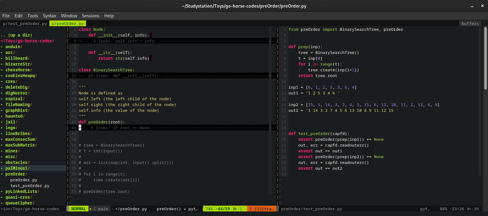

# Stdout in Pytest   
Today I learn how to test stdout with pytest.  

The code is something near this:
```python   
def test_yourfunction(capfd):   
    out, err = capfd.readouterr()   
    assert out == 'the expected printed stdout'
``` 

And here is an image of a working test of a hacker rank exercise:   

    
Pay attention to the right side (test_preOrder.py), lines 19, 21 and 22.

## References:   
[Pytest doc](https://pytest.org/en/latest/reference/reference.html?highlight=capfd#capfd) site   
[Hacker rank](https://www.hackerrank.com/interview/preparation-kits/one-week-preparation-kit/one-week-day-seven/challenges) exercise   
the editor in the image is [gvim with this .vimrc](https://github.com/Craftermath/vimrc/blob/master/.vimrc)